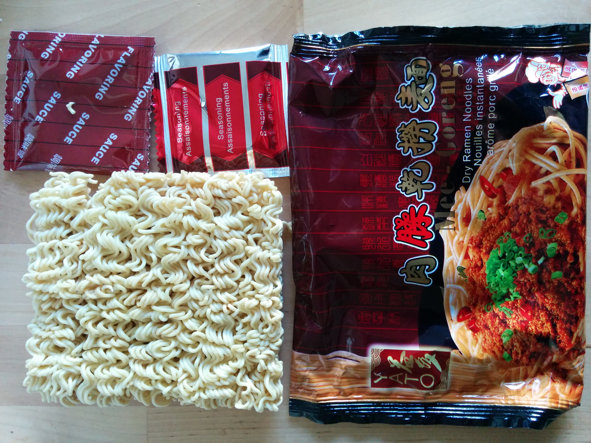
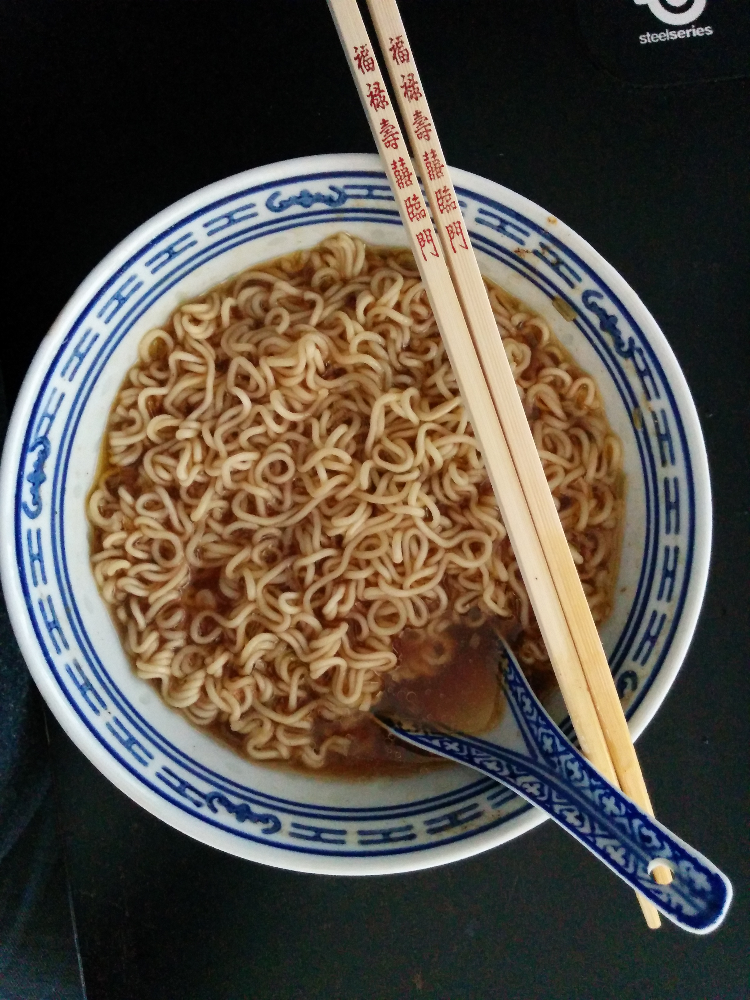

Instant Noodles Test
====================

From China Livs Möllan 
1. Yato Mee-Goreng 

1. Yato Mee-Goreng
------------------
Dry (!) Ramen Noodles

Didnt realize they were dry noodles when i bought them. I am in the market for noodle soup so I made a soup anyway. 

Spicyness: 0/5 
Noodles: 7/10 
Richness: 5/10 
Flavour: 7/10 
Buy-again: 7/10  

Good noodles. Not a lot of flavour. Oily is a plus. I'll def enjoy them. 
The taste is good but a little weak. 

