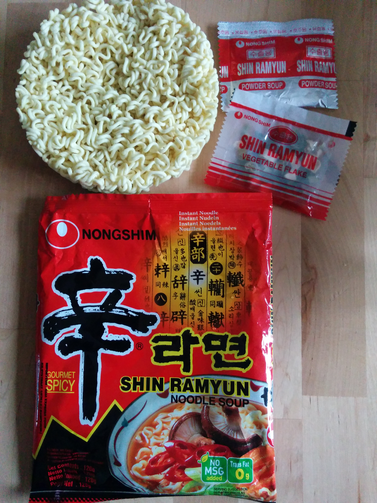

Instant Noodles Test 
====================

1. **Yato Mee-Goreng**  
2. **Samyang Ramen Sutah**  
3. **Kang Shi Fu Chicken**  
4. **Shin Ramyun Gourmet Spicy**  
5. **Kang Shi Fu Seafood**  

1. Yato Mee-Goreng 
------------------ 

Dry (!) Ramen Noodles  

Didnt realize they were dry noodles when i bought them. I am in the market for
noodle soup so I made a soup anyway.  

**Spicyness: 2/10**  
**Noodles: 7/10**  
**Richness: 5/10**  
**Flavour: 7/10**  
**Buy-again: 6/10**    

Ok soup, but not a lot of flavour. Oily is a plus. I'll def enjoy them.  The
taste is good but a little weak. Prob becouse of not meant to be soup. 

2. Samyang Ramen Sutah 
---------------------- 

Hot&Spicy Flavour  

**Spicyness: 8/10**  
**Noodles: 5/10**  
**Richness: 7/10**  
**Flavour: 8/10**  
**Buy-again: 8/10**  

Very good soup. Almost perfect spicyness. slightly strong. Noodles are a bit
tasteless. No broth is a minus on the richness, only powder and garnish. 

3. Kang Shi Fu Chicken Noodle 
----------------------

**Spicyness: 3/10**  
**Noodles: 8/10**  
**Richness: 9/10**  
**Flavour: 8/10**  
**Buy-again: 9/10**  

First time Kang Shi Fu chicken soup. Very rich taste, but does it taste
Chicken? Never the less, Kang Shi Fu delivers outstanding tasting noodles as usual.
The noodles are not spicy at all, but still rich in flavour. Would buy again. 

4. Shin Ramyun Gourmet Spicy 
----------------------
noodle soup

**Spicyness: 8/10**  
**Noodles: 8/10**  
**Richness: 6/10**  
**Flavour: 6/10**  
**Buy-again: 7/10**  

Only powder soup reduces the richness and these noodles have a hard time competing 
with broth noodle soups. Still, good spicyness. Flavour is not awesome but still very
edible noodles. 

5. Kang Shi Fu Seafood
----------------------

**Spicyness: 3/10**  
**Noodles: 8/10**  
**Richness: 9/10**  
**Flavour: 6/10**  
**Buy-again: 7/10**  

First time Kang Shi Fu seafood soup. Very rich taste, but the seafood flavour is not my
style.The noodles are not spicy at all, but still rich in flavour. Would only buy again if 
i need a break from beef flavour. 

