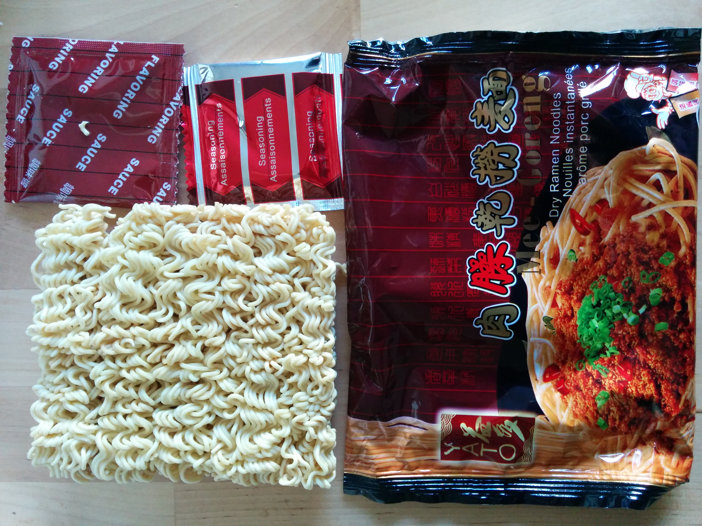
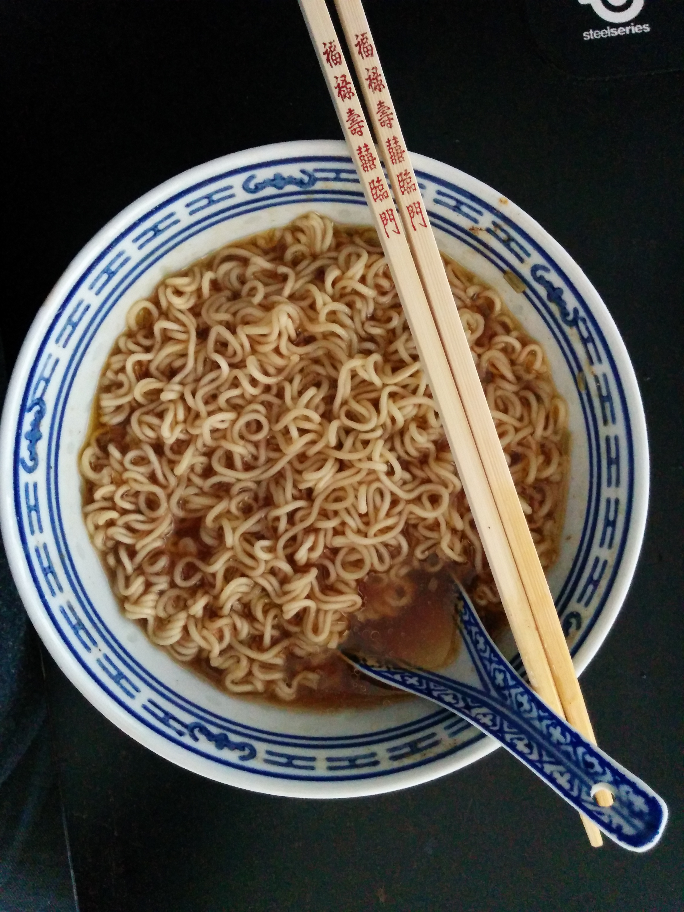
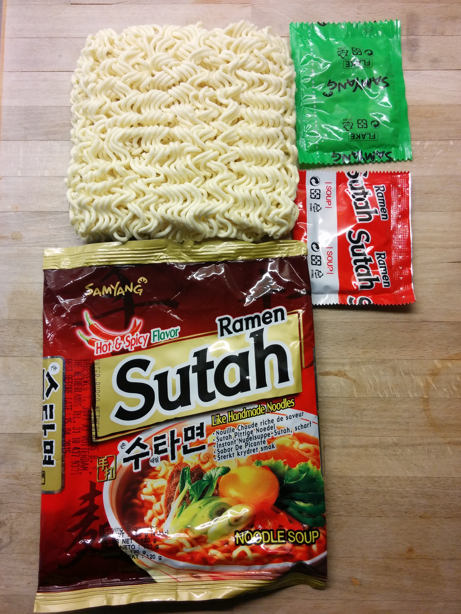
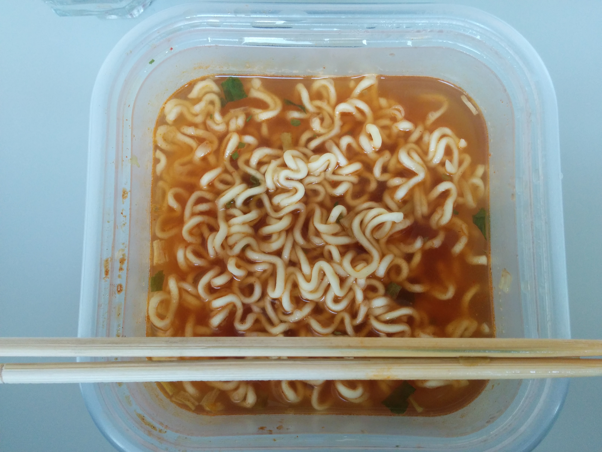

Instant Noodles Test
====================

From China Livs Möllan  
1. Yato Mee-Goreng  
2. Samyang Ramen Sutah  

1. Yato Mee-Goreng
------------------
Dry (!) Ramen Noodles  

Didnt realize they were dry noodles when i bought them. I am in the market for noodle soup so I made a soup anyway.  

Spicyness: 2/10  
Noodles: 7/10  
Richness: 5/10  
Flavour: 7/10  
Buy-again: 6/10    

Good soup. Not a lot of flavour. Oily is a plus. I'll def enjoy them. 
The taste is good but a little weak. 

2. Samyang Ramen Sutah
----------------------
Hot&Spicy Flavour  

Spicyness: 8/10  
Noodles: 5/10  
Richness: 7/10  
Flavour: 8/10  
Buy-again: 8/10  

Very good soup. Almost perfect spicyness. slightly strong. Noodles are a bit tasteless. No broth is a minus on the richness, only powder and garnish. 

